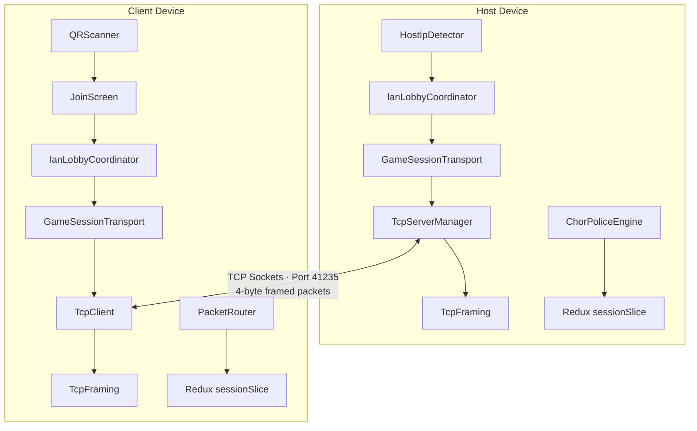

# Chor Police — LAN Multiplayer Mobile Game 📱🚔

[](https://play.google.com/store/apps/details?id=com.dheeraj.chorpolice)
[](https://play.google.com/store/apps/details?id=com.dheeraj.chorpolice)
[-blue?style=for-the-badge)](file:///c:/Users/rahul/work/chorpolice-1/chorpolice/app.config.ts)
[](https://expo.dev)
[](https://reactnative.dev)

> **Official Store Version v7.5.0 (Build 110)** — Live on Google Play Store with **1,000+ Organic Downloads** and a **4.4★ Rating**!

**Chor Police** is a modern, high-performance mobile remake of the iconic Indian paper card game **"Raja Mantri Chor Sipahi"**. Engineered with a zero-cloud, peer-to-peer (P2P) TCP socket networking layer, it allows 4 players to play real-time offline multiplayer over a shared Wi-Fi network or mobile Hotspot without any internet connectivity.

---

## 🌟 Key Technical Features

- **⚡ Zero-Cloud Local P2P Multiplayer**: Built on raw TCP sockets (`react-native-tcp-socket`). One device acts as a native TCP server (Port `41235`) while others connect seamlessly as clients without any central cloud backend.
- **📦 Custom 4-Byte Length-Prefixed Binary Packet Framing**: Implements `[4B UInt32BE Length Header][JSON Payload]` byte-stream framing (`TcpFraming.ts`) with a 1MB OOM protection guard to handle partial reads and stream reassembly.
- **🔄 Chess.com-Style Reconnection & State Sync**: Features a fault-tolerant 15s (client) / 60s (host) auto-reconnection overlay (`GlobalReconnectOverlay`), dynamic state synchronization (`SYNC_STATE`), and automated coin escrow refund/forfeit ledgers (`matchSettlementLedger`).
- **📱 QR Code Instant Room Discovery**: High-contrast QR generation (`HostInviteCard`) with tap-to-enlarge modal and lazy camera scanning (`QRScanner` via `expo-camera`) with native haptic success feedback.
- **🤖 Intelligent Bot AI Fallback**: Organically replaces empty or disconnected player slots with intelligent AI bots (`ChorPoliceBotBehavior`) using human-like 1.2s–2.4s thinking delays.
- **🧩 12-Phase Finite State Machine**: Decoupled game engine (`ChorPoliceEngine.ts`) driving 12 distinct game phases: `idle` → `waiting` → `dealing` → `private_reveal` → `investigation_shuffle` → `police_turn` → `result` → `round_video` → `score_quiz` → `video_transition` → `final_result` → `finished`.
- **💡 Level 2 Bonus Score Quiz**: Host-authoritative trivia mode with a 15-second timer and ±2000 point scoring system.
- **🛡️ Custom Expo Config Plugin**: Includes [`withAndroidNearbyFixed.ts`](file:///c:/Users/rahul/work/chorpolice-1/chorpolice/plugins/withAndroidNearbyFixed.ts) modifying Android Manifest permissions (`NEARBY_WIFI_DEVICES` with `neverForLocation` flag) for Android 12+ P2P discovery compliance.

---

## 🛠️ Architecture & Tech Stack



| Layer | Technology |
| :--- | :--- |
| **Core Framework** | React Native 0.85 (New Architecture / Hermes Engine) |
| **Platform / Tooling** | Expo SDK 56, Expo Router v56, EAS Build |
| **Networking** | `react-native-tcp-socket`, `@react-native-community/netinfo`, `nanoid` |
| **State Management** | Redux Toolkit (`sessionSlice`, `reconnectSlice`), MMKV Storage |
| **Styling & Animation** | NativeWind CSS v4, `react-native-reanimated` v4, `moti` |
| **Hardware Integration** | `expo-camera`, `expo-haptics`, `expo-audio`, `expo-video` |

---

## 📂 Documentation

Comprehensive technical documentation is available in the [`docs/`](file:///c:/Users/rahul/work/chorpolice-1/chorpolice/docs) directory:

- 📘 [`docs/LAN_PROJECT_DOCUMENTATION.md`](file:///c:/Users/rahul/work/chorpolice-1/chorpolice/docs/LAN_PROJECT_DOCUMENTATION.md) — Complete 60+ file technical reference & architecture manual.
- 📡 [`docs/LAN_NETWORKING_ARCHITECTURE.md`](file:///c:/Users/rahul/work/chorpolice-1/chorpolice/docs/LAN_NETWORKING_ARCHITECTURE.md) — Deep-dive on TCP packet framing, handshake & protocol.
- 🎮 [`docs/LAN_GAMEPLAY_FLOW.md`](file:///c:/Users/rahul/work/chorpolice-1/chorpolice/docs/LAN_GAMEPLAY_FLOW.md) — Phase-by-phase game lifecycle & state transitions.
- 🚀 [`docs/VERSION_BUMP_CHECKLIST.md`](file:///c:/Users/rahul/work/chorpolice-1/chorpolice/docs/VERSION_BUMP_CHECKLIST.md) — Play Store release & version bump checklist.

---

## 🚀 Getting Started (Development Setup)

### Prerequisites
- Node.js (v18 or higher)
- Expo Go app or Android Studio (for emulator / native builds)

### Installation

1. **Clone the Repository:**
   ```bash
   git clone https://github.com/Dheeraj23qw/chorpolice-playstore.git
   cd chorpolice-playstore
   ```

2. **Install Dependencies:**
   ```bash
   npm install
   ```

3. **Start Development Server:**
   ```bash
   npx expo start
   ```

4. **Run on Android Device / Emulator:**
   ```bash
   npm run android
   ```

---

## 📦 Production Builds

To build the production `.aab` bundle for the Google Play Store using EAS:

```bash
# Production Release Build
eas build --platform android --profile production

# Over-The-Air (OTA) JS/TS Updates
eas update --branch production --message "Release update v7.5.0"
```

---

## 👤 Author & License

- **Developer**: Dheeraj Kumar (B.Tech Electrical Engineering, **NIT Jamshedpur**)
- **Play Store**: [Chor Police on Google Play](https://play.google.com/store/apps/details?id=com.dheeraj.chorpolice)
- **LinkedIn**: [linkedin.com/in/nitiandheeraj](https://linkedin.com/in/nitiandheeraj)
- **GitHub**: [github.com/Dheeraj23qw](https://github.com/Dheeraj23qw)

---
*Built with ❤️ in React Native & Expo.*
