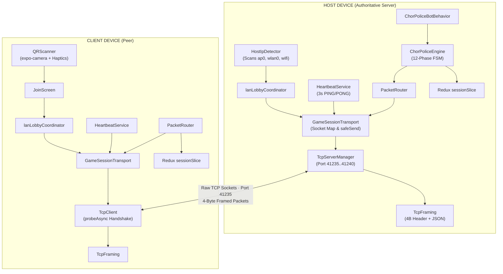
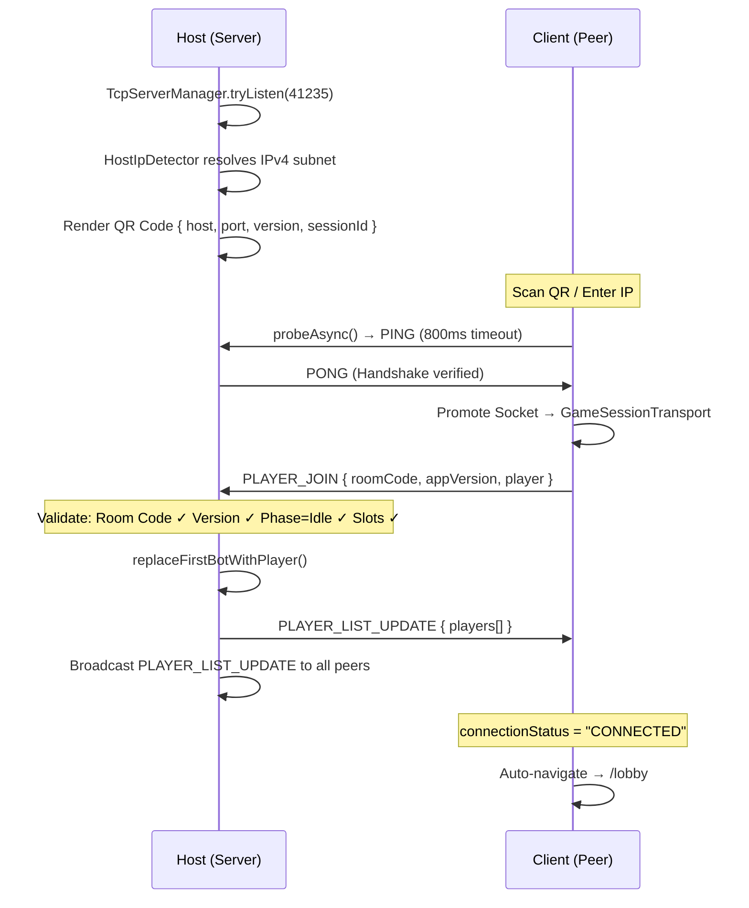
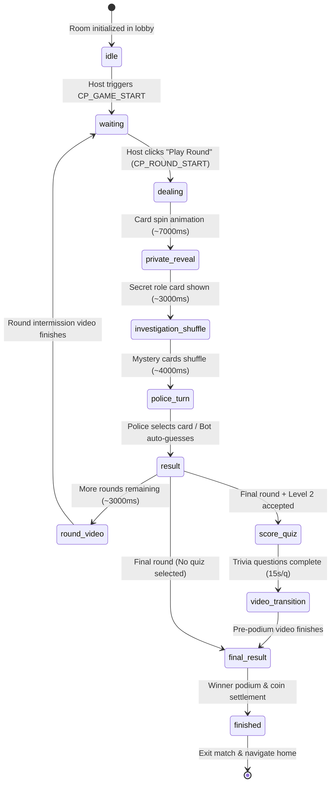

<div align="center">

# 🚔 Chor Police — Zero-Cloud P2P Multiplayer Engine

**A Production-Grade, Peer-to-Peer Offline Multiplayer Mobile Engine Built on React Native & Raw TCP Sockets**

[](https://play.google.com/store/apps/details?id=com.dheeraj.chorpolice)
[](https://play.google.com/store/apps/details?id=com.dheeraj.chorpolice)
[-blue?style=for-the-badge)](file:///c:/Users/rahul/work/chorpolice-1/chorpolice/app.config.ts)
[](https://expo.dev)
[](https://reactnative.dev)
[](https://hermesengine.dev)
[](LICENSE)

[Live App on Play Store](https://play.google.com/store/apps/details?id=com.dheeraj.chorpolice) • [Technical Architecture Docs](docs/LAN_PROJECT_DOCUMENTATION.md) • [Networking Spec](docs/LAN_NETWORKING_ARCHITECTURE.md) • [Game Flow Spec](docs/LAN_GAMEPLAY_FLOW.md)

</div>

---

## 📌 Executive Overview

**Chor Police** is an open-source, high-performance mobile remake of the iconic Indian paper-and-pencil strategy game *"Raja Mantri Chor Sipahi"*. 

Rather than relying on central cloud servers (e.g. Firebase, AWS, WebSockets), **Chor Police** features an autonomous **Peer-to-Peer (P2P) Local Networking Architecture** built directly on native Android TCP sockets. One mobile device assumes the role of an authoritative TCP socket server, orchestrating real-time state synchronization, fault tolerance, and AI bot fallback across 4 connected physical devices over local Wi-Fi or mobile Hotspot — **with zero cellular data or internet connection required**.

---

## 📊 Architectural Benchmark: Cloud vs. Zero-Cloud P2P

| Metric / Dimension | Traditional Cloud Multiplayer (Socket.io / Firebase) | Chor Police P2P LAN Architecture |
| :--- | :--- | :--- |
| **Server Infrastructure Cost** | High (Monthly cloud server / database fees) | **\$0 (Zero cloud dependence)** |
| **Internet Dependency** | 100% Online Active Cellular Data Required | **100% Offline (Local Wi-Fi / Hotspot)** |
| **Network Latency** | ~80ms – 250ms (Round-trip to cloud region) | **< 3ms (Sub-millisecond local LAN hop)** |
| **Wire Protocol** | Heavy WebSocket frames / HTTP Long-Polling | **Custom 4-Byte Binary Length-Prefixed TCP Stream** |
| **Fault Recovery** | Server-side disconnect cleanup | **Chess.com-Style Reconnection Overlay & State Sync** |
| **App Store Performance** | 1,000+ Downloads | **1,000+ Organic Downloads \| 4.4★ Rating** |

---

## ⚡ Core Technical Innovations

### 1. 📦 Binary Length-Prefixed Packet Framing (`TcpFraming.ts`)
TCP is a streaming byte-oriented protocol without inherent message boundaries. Our framing engine prefixes every payload with a 4-byte Big-Endian Unsigned 32-bit Integer representing the payload size:

```
┌───────────────────────────────────────┬─────────────────────────────────────────────────┐
│     Payload Length Header (4 Bytes)   │            JSON Envelope (N Bytes)              │
│       UInt32 Big-Endian (e.g. 0x0080) │   {"version":"2.0.0","packet":{"type":...}}     │
└───────────────────────────────────────┴─────────────────────────────────────────────────┘
```
- **1MB OOM Protection Guard**: Immediately drops buffers exceeding 1,048,576 bytes to block OOM allocation attacks.
- **Stream Reassembly**: Accumulates partial TCP chunks across packet fragments into per-socket byte arrays without memory leakage.

### 2. 🔄 Fault-Tolerant Reconnection Engine (`reconnectSlice.ts`)
- **Active Discovery & Retries**: 15-second client and 60-second host reconnection windows with global UI countdown overlays (`GlobalReconnectOverlay`).
- **State Reconciliation (`SYNC_STATE`)**: Automatically streams complete round snapshots (`roles`, `gamePhase`, `scores`, `currentRound`) upon client rejoin.
- **Financial Escrow Guard (`matchSettlementLedger`)**: Executes coin forfeits for quitting players while guaranteeing automated refunds to innocent peers.

### 3. 🤖 Human-in-the-Loop AI Bot Fallback (`ChorPoliceBotBehavior.ts`)
- Dynamically fills empty room seats or disconnected player slots with AI bots.
- Implements human-like random thinking delays ($1.2\text{s} \le t \le 2.4\text{s}$) during Police investigation turns.
- Seamlessly hot-swaps human player handles with AI decision engines on socket teardown.

### 4. 🛡️ Native AST Manifest Plugin (`withAndroidNearbyFixed.ts`)
- Custom Expo Config Plugin utilizing `@expo/config-plugins` (`withAndroidManifest`).
- Injects `NEARBY_WIFI_DEVICES` with `usesPermissionFlags="neverForLocation"` to satisfy Google Play Store privacy guidelines without triggering location access warnings.

---

## 📐 System Architecture & Data Flow



---

## 🔄 Handshake & Reconnection Protocols

### Connection Handshake Sequence



---

## 🎮 12-Phase State Machine Lifecycle

The core game logic ([`ChorPoliceEngine.ts`](file:///c:/Users/rahul/work/chorpolice-1/chorpolice/service/ChorPoliceEngine.ts)) transitions deterministically through 12 execution phases:



---

## 📂 File Directory Structure

```
chorpolice/
├── service/                          # ── Core Services & Networking ──
│   ├── network/
│   │   ├── TcpFraming.ts             # 4-Byte UInt32BE length-prefixed packet framer
│   │   ├── TcpClient.ts              # TCP client manager & probeAsync() handshake
│   │   ├── TcpServerManager.ts       # TCP server lifecycle & port rotation (41235..41240)
│   │   ├── GameSessionTransport.ts   # Session socket registry & safeSend() write guard
│   │   ├── HeartbeatService.ts       # 3s PING/PONG keepalive & AP isolation detector
│   │   ├── LobbyPacketHandler.ts     # Handshake, room validation & bot-to-human slot swap
│   │   └── normalizePeerIp.ts        # IPv6 / port normalization helper
│   ├── ChorPoliceEngine.ts           # Master 12-phase finite state machine & scoring
│   ├── ChorPoliceBotBehavior.ts      # AI bot decision engine & thinking delay
│   ├── HostIpDetector.ts             # Multicast/Hotspot interface IPv4 scanner
│   ├── lanLobbyCoordinator.ts        # High-level host/join coordinator
│   ├── lanGameService.ts             # In-game packet router & reconnection manager
│   └── PacketRouter.ts               # Open-Closed Principle (OCP) packet dispatcher
│
├── redux/                            # ── Global State Management ──
│   ├── reducers/
│   │   ├── sessionSlice.ts           # Redux store for game phase, players, roles, economy
│   │   └── reconnectSlice.ts         # Redux store for overlay countdown & reconnection
│   ├── selectors/sessionSelectors.ts # Memoized Redux selectors
│   └── store.ts                      # Central Redux store configuration
│
├── hooks/                            # ── Custom React Hooks ──
│   ├── useChorPoliceMultiplayer/     # Master gameplay orchestrator hook
│   ├── chorPoliceMultiplayer/
│   │   ├── useCPRevealSequence.ts    # Multi-stage card reveal timing manager
│   │   ├── useCPScoreQuiz.ts         # Level 2 trivia countdown & scoring hook
│   │   ├── useCPEconomy.ts          # Wallet stake debits, escrow & pot settlement
│   │   ├── useCPCleanup.ts          # Socket teardown & resource disposal
│   │   └── handlers/                 # Modular packet payload processors
│   └── useLobbyLogic.ts              # Pre-game room setup & player ready logic
│
├── screens/                          # ── Screen Views & Components ──
│   ├── JoinScreen.tsx                # QR camera scanner & manual IPv4 join screen
│   ├── LobbySetupScreen.tsx          # Interactive room setup, avatar picker & player list
│   └── ChorPoliceMultiplayer/        # Phase-driven multiplayer gameplay views
│
├── app/                              # ── Expo Router File-Based Routes ──
│   ├── multiplayer/index.tsx         # Route entry & location permission gate
│   ├── host/index.tsx                # Host setup route
│   ├── join/index.tsx                # Join route
│   ├── lobby/index.tsx               # Waiting room route
│   └── chor-police-mp/index.tsx      # Main gameplay screen route
│
├── plugins/                          # ── Custom Expo Config Plugins ──
│   └── withAndroidNearbyFixed.ts     # Injects NEARBY_WIFI_DEVICES into AndroidManifest.xml
│
└── docs/                             # ── Technical Documentation ──
    ├── LAN_PROJECT_DOCUMENTATION.md  # 60+ file complete architecture reference
    ├── LAN_NETWORKING_ARCHITECTURE.md# TCP framing & handshake spec
    ├── LAN_GAMEPLAY_FLOW.md          # State machine phase breakdown
    └── VERSION_BUMP_CHECKLIST.md     # Production release workflow guide
```

---

## 🛠️ Development & Build Setup

### Prerequisites
- **Node.js**: `v18.0.0` or higher
- **Package Manager**: `npm` (v9+)
- **Mobile Environment**: Android Studio (Emulator) or Physical Android Device (Android 7.0+)

### Quick Start (Local Development)

1. **Clone Repository:**
   ```bash
   git clone https://github.com/Dheeraj23qw/chorpolice-playstore.git
   cd chorpolice-playstore
   ```

2. **Install Dependencies:**
   ```bash
   npm install
   ```

3. **Start Expo Development Server:**
   ```bash
   npx expo start
   ```

4. **Launch Native Android App:**
   ```bash
   npm run android
   ```

---

## 📦 Production Builds (EAS & Play Store)

To build a signed Android App Bundle (`.aab`) for Google Play Store deployment:

```bash
# Build Production Release AAB via Expo Application Services
eas build --platform android --profile production

# Publish Over-The-Air (OTA) Instant Update
eas update --branch production --message "Release update v7.5.0"
```

---

## 👤 Author & Acknowledgments

- **Lead Architect & Developer**: Dheeraj Kumar
- **Education**: B.Tech in Electrical Engineering, **National Institute of Technology, Jamshedpur**
- **Play Store App**: [Chor Police on Google Play](https://play.google.com/store/apps/details?id=com.dheeraj.chorpolice)
- **LinkedIn**: [linkedin.com/in/nitiandheeraj](https://linkedin.com/in/nitiandheeraj)
- **GitHub**: [github.com/Dheeraj23qw](https://github.com/Dheeraj23qw)

---

<div align="center">
  <sub>Built with ❤️ using React Native, Expo, and Native Android TCP Sockets.</sub>
</div>
