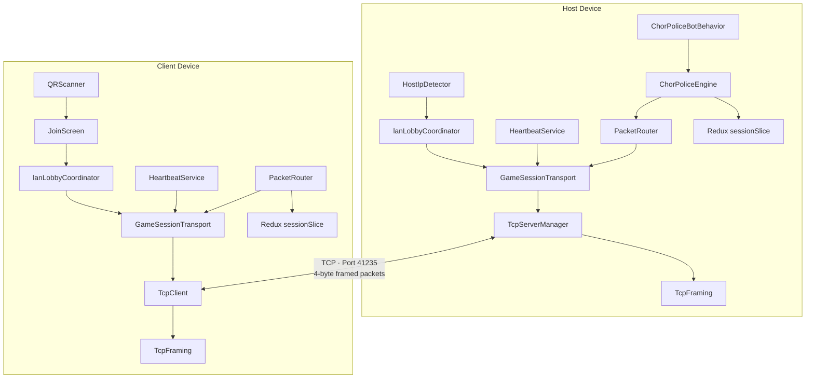
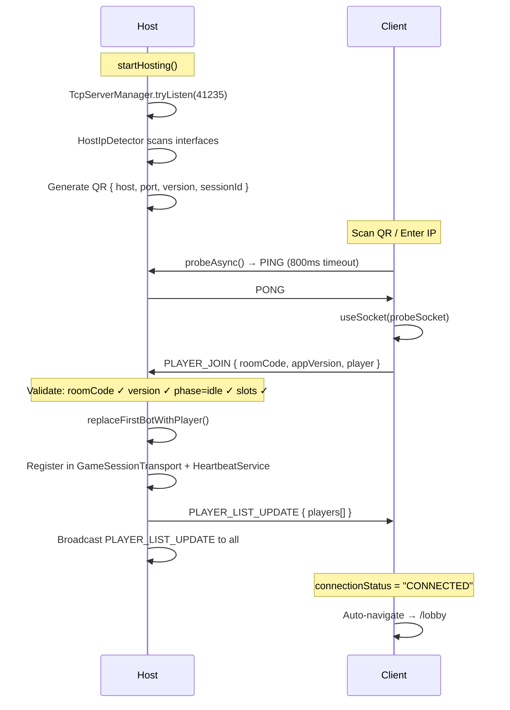
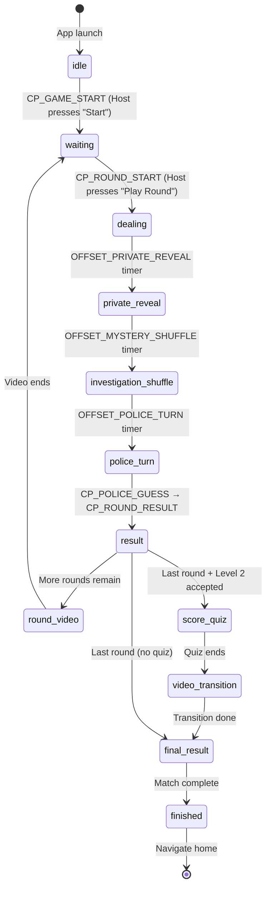
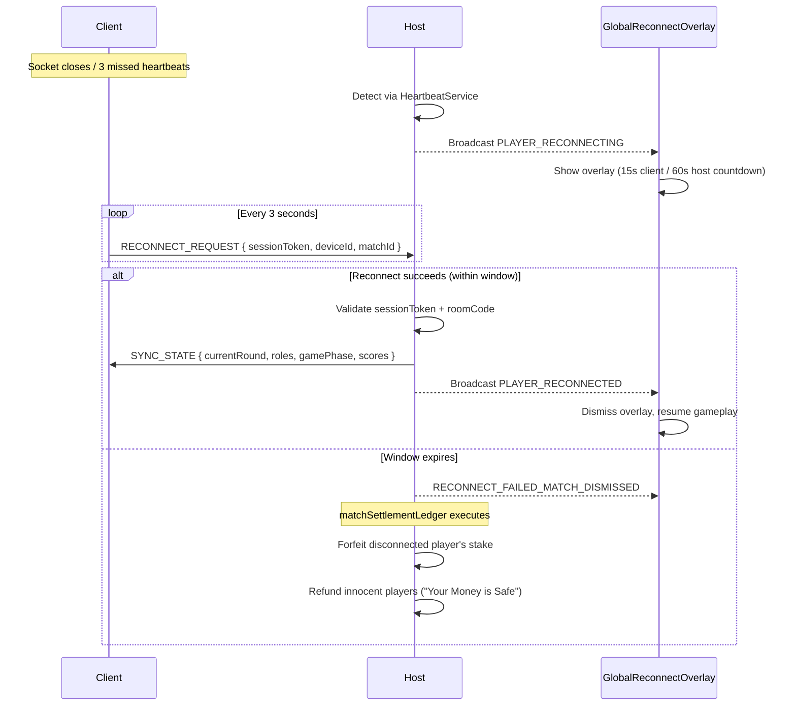
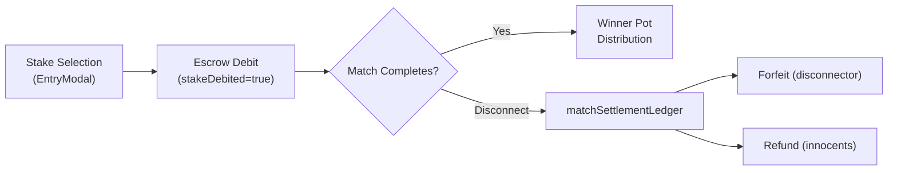
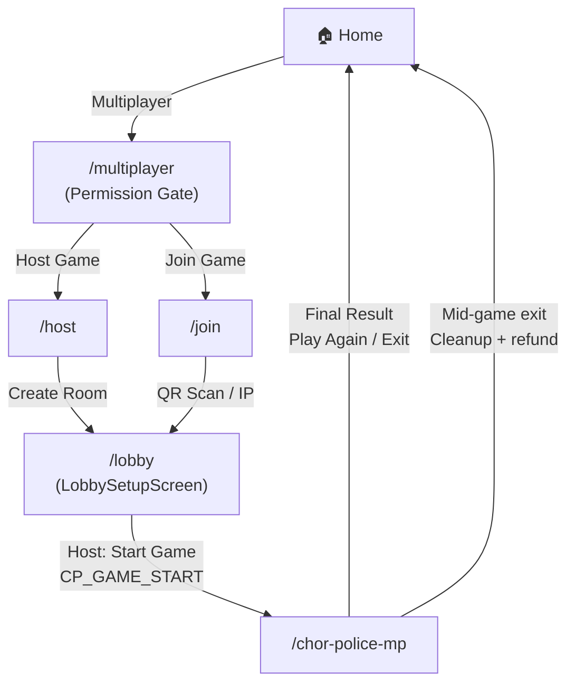

# Chor Police — LAN Multiplayer Technical Documentation

> Complete architecture and implementation reference for the LAN multiplayer system in **Chor Police**, built with Expo SDK 56 / React Native 0.85 / `react-native-tcp-socket`.

---

## Table of Contents

1. [Architecture Overview](#1-architecture-overview)
2. [Complete File Structure](#2-complete-file-structure)
3. [Networking Layer](#3-networking-layer)
4. [Game Flow & Phase Machine](#4-game-flow--phase-machine)
5. [Role Assignment Algorithm](#5-role-assignment-algorithm)
6. [Redux State Management](#6-redux-state-management)
7. [Reconnection & Resilience](#7-reconnection--resilience)
8. [Economy System](#8-economy-system)
9. [QR Code System](#9-qr-code-system)
10. [UI Components](#10-ui-components)
11. [Screen Navigation](#11-screen-navigation)
12. [Custom Expo Plugin](#12-custom-expo-plugin)
13. [Constants & Configuration](#13-constants--configuration)
14. [Key Dependencies](#14-key-dependencies)

---

## 1. Architecture Overview



| Concept | Detail |
|---------|--------|
| **Transport** | Raw TCP via `react-native-tcp-socket` |
| **Default Port** | `41235` (fallback rotation: `41236`…`41240` → OS dynamic `0`) |
| **Protocol Version** | `2.0.0` |
| **Framing** | 4-byte `uint32BE` length-prefix + UTF-8 JSON envelope |
| **OOM Guard** | Rejects frames > 1 MB |
| **Discovery** | QR code scan or manual IP entry with TCP probe handshake |
| **Max Players** | 4 (1 human host + up to 3 humans/bots) |
| **Heartbeat** | `PING/PONG` every 3 seconds |
| **Reconnection** | Chess.com-style: 15s client / 60s host window |

---

## 2. Complete File Structure

### Networking Layer (`service/network/`)

| File | Responsibility |
|------|----------------|
| [`TcpFraming.ts`](file:///c:/Users/rahul/work/chorpolice-1/chorpolice/service/network/TcpFraming.ts) | Binary packet framing: `[4B uint32BE length][UTF-8 JSON envelope]`, stream extraction, 1MB OOM boundary |
| [`TcpClient.ts`](file:///c:/Users/rahul/work/chorpolice-1/chorpolice/service/network/TcpClient.ts) | Client TCP connection, timeout guards, `attemptId` tracking, `probeAsync()` for fast host verification |
| [`TcpServerManager.ts`](file:///c:/Users/rahul/work/chorpolice-1/chorpolice/service/network/TcpServerManager.ts) | TCP server binding with timeout and port rotation (`tryListen`) |
| [`GameSessionTransport.ts`](file:///c:/Users/rahul/work/chorpolice-1/chorpolice/service/network/GameSessionTransport.ts) | Transport orchestrator: port rotation, socket map, `safeSend()` guard, peer IP registration |
| [`HeartbeatService.ts`](file:///c:/Users/rahul/work/chorpolice-1/chorpolice/service/network/HeartbeatService.ts) | 3-second PING/PONG keepalive, AP isolation detection, stale peer detection |
| [`TcpDiagnostics.ts`](file:///c:/Users/rahul/work/chorpolice-1/chorpolice/service/network/TcpDiagnostics.ts) | `TCP_STATS` counters: safeSend attempts, successes, dropped sockets, stale callbacks |
| [`normalizePeerIp.ts`](file:///c:/Users/rahul/work/chorpolice-1/chorpolice/service/network/normalizePeerIp.ts) | Strips IPv6 `::ffff:` prefixes and port suffixes to prevent key mismatches |
| [`LobbyPacketHandler.ts`](file:///c:/Users/rahul/work/chorpolice-1/chorpolice/service/network/LobbyPacketHandler.ts) | Lobby protocol: `PLAYER_JOIN`, `PLAYER_LIST_UPDATE`, `PLAYER_LEAVE`, version checks, bot-to-human promotion |
| [`LobbyDataHelpers.ts`](file:///c:/Users/rahul/work/chorpolice-1/chorpolice/service/network/LobbyDataHelpers.ts) | `buildJoinPacket()`, `sanitizeJoiningPlayer()`, change detection |
| [`LobbyToastVisibility.ts`](file:///c:/Users/rahul/work/chorpolice-1/chorpolice/service/network/LobbyToastVisibility.ts) | Controls player join/leave toast display based on game state |

---

### Game Services (`service/`)

| File | Responsibility |
|------|----------------|
| [`ChorPoliceEngine.ts`](file:///c:/Users/rahul/work/chorpolice-1/chorpolice/service/ChorPoliceEngine.ts) | Master game engine (`IGameEngine`): role shuffling, police guess evaluation, scoring, pot calculation, game-end triggers |
| [`ChorPoliceBotBehavior.ts`](file:///c:/Users/rahul/work/chorpolice-1/chorpolice/service/ChorPoliceBotBehavior.ts) | Bot AI: 1.2–2.4s thinking delay, auto police guess, mid-game bot replacement |
| [`lanLobbyCoordinator.ts`](file:///c:/Users/rahul/work/chorpolice-1/chorpolice/service/lanLobbyCoordinator.ts) | High-level lobby: `initHostLobby`, `hostLanLobby`, `joinLanLobby`, `leaveLanLobby`, candidate probing |
| [`lanGameService.ts`](file:///c:/Users/rahul/work/chorpolice-1/chorpolice/service/lanGameService.ts) | Packet routing, listener management, reconnection lifecycle, match dismissal, stake settlement |
| [`HostIpDetector.ts`](file:///c:/Users/rahul/work/chorpolice-1/chorpolice/service/HostIpDetector.ts) | Async IP detection loop scanning `ap0`, `wlan0`, `wlan1`, `wifi` interfaces + NetInfo; generates room codes |
| [`PacketRouter.ts`](file:///c:/Users/rahul/work/chorpolice-1/chorpolice/service/PacketRouter.ts) | OCP registry routing packets to registered `IGameEngine` implementations |
| [`packetDispatcher.ts`](file:///c:/Users/rahul/work/chorpolice-1/chorpolice/service/packetDispatcher.ts) | Decoupled event bus for bot packet dispatch without circular imports |
| [`interfaces/IGameEngine.ts`](file:///c:/Users/rahul/work/chorpolice-1/chorpolice/service/interfaces/IGameEngine.ts) | Engine interface: `canHandle`, `processMultiplayer`, `reset` |

---

### Redux State (`redux/`)

| File | Responsibility |
|------|----------------|
| [`reducers/sessionSlice.ts`](file:///c:/Users/rahul/work/chorpolice-1/chorpolice/redux/reducers/sessionSlice.ts) | Core session state: connection, game phase, players, roles, economy, deal animations |
| [`reducers/reconnectSlice.ts`](file:///c:/Users/rahul/work/chorpolice-1/chorpolice/redux/reducers/reconnectSlice.ts) | Reconnection overlay: `isActive`, countdown timer, `matchId`, resolution |
| [`selectors/sessionSelectors.ts`](file:///c:/Users/rahul/work/chorpolice-1/chorpolice/redux/selectors/sessionSelectors.ts) | Memoized session selectors |
| [`store.ts`](file:///c:/Users/rahul/work/chorpolice-1/chorpolice/redux/store.ts) | Global store configuration |

---

### Hooks (`hooks/`)

| File | Responsibility |
|------|----------------|
| [`useChorPoliceMultiplayer.ts`](file:///c:/Users/rahul/work/chorpolice-1/chorpolice/hooks/useChorPoliceMultiplayer/useChorPoliceMultiplayer.ts) | Master gameplay hook: Redux, animations, countdowns, interaction handlers, packet listeners |
| [`useCPRevealSequence.ts`](file:///c:/Users/rahul/work/chorpolice-1/chorpolice/hooks/chorPoliceMultiplayer/useCPRevealSequence.ts) | Multi-stage reveal: dealing → public reveal → private reveal → mystery shuffle → police turn |
| [`useCPScoreQuiz.ts`](file:///c:/Users/rahul/work/chorpolice-1/chorpolice/hooks/chorPoliceMultiplayer/useCPScoreQuiz.ts) | Level 2 bonus trivia: host-authoritative questions, 15s timer, ±2000 scoring |
| [`useCPEconomy.ts`](file:///c:/Users/rahul/work/chorpolice-1/chorpolice/hooks/chorPoliceMultiplayer/useCPEconomy.ts) | Wallet stake debits, escrow, refunds on disconnect, winner pot settlement |
| [`useCPCleanup.ts`](file:///c:/Users/rahul/work/chorpolice-1/chorpolice/hooks/chorPoliceMultiplayer/useCPCleanup.ts) | Timer cancellation, socket teardown, engine reset, navigation cleanup |
| [`useLobbyLogic.ts`](file:///c:/Users/rahul/work/chorpolice-1/chorpolice/hooks/useLobbyLogic.ts) | Pre-game lobby: player sync, stake/round selection, bot slots, `GAME_START` dispatch |

---

### Packet Handlers (`hooks/chorPoliceMultiplayer/handlers/`)

| File | Handles |
|------|---------|
| [`packetRouter.ts`](file:///c:/Users/rahul/work/chorpolice-1/chorpolice/hooks/chorPoliceMultiplayer/handlers/packetRouter.ts) | Routes packets to specialized handlers |
| [`policeHandlers.ts`](file:///c:/Users/rahul/work/chorpolice-1/chorpolice/hooks/chorPoliceMultiplayer/handlers/policeHandlers.ts) | `CP_ROUND_RESULT`: smash-out animation, score calculation, phase transition |
| [`revealHandlers.ts`](file:///c:/Users/rahul/work/chorpolice-1/chorpolice/hooks/chorPoliceMultiplayer/handlers/revealHandlers.ts) | `CP_PUBLIC_REVEAL`: card reveal sequence trigger |
| [`quizHandlers.ts`](file:///c:/Users/rahul/work/chorpolice-1/chorpolice/hooks/chorPoliceMultiplayer/handlers/quizHandlers.ts) | `CP_SCORE_QUIZ_*`: Level 2 quiz flow |
| [`sessionHandlers.ts`](file:///c:/Users/rahul/work/chorpolice-1/chorpolice/hooks/chorPoliceMultiplayer/handlers/sessionHandlers.ts) | `PLAYER_LEAVE`, `host_quit`, heartbeat timeouts → refunds |
| [`economyHandlers.ts`](file:///c:/Users/rahul/work/chorpolice-1/chorpolice/hooks/chorPoliceMultiplayer/handlers/economyHandlers.ts) | `CP_GAME_END`: score updates, coin payouts |
| [`types.ts`](file:///c:/Users/rahul/work/chorpolice-1/chorpolice/hooks/chorPoliceMultiplayer/handlers/types.ts) | Shared TypeScript context interfaces |

---

### Screens (`screens/`)

| File | Purpose |
|------|---------|
| [`JoinScreen.tsx`](file:///c:/Users/rahul/work/chorpolice-1/chorpolice/screens/JoinScreen.tsx) | QR scan / manual IP join, IPv4 validation, auto-navigate to `/lobby` |
| [`LobbySetupScreen.tsx`](file:///c:/Users/rahul/work/chorpolice-1/chorpolice/screens/LobbySetupScreen.tsx) | Main lobby UI (host & guest views) |
| [`ChorPoliceMultiplayer/index.tsx`](file:///c:/Users/rahul/work/chorpolice-1/chorpolice/screens/ChorPoliceMultiplayer/index.tsx) | Phase-driven gameplay container |
| [`ChorPoliceMultiplayer/views/WaitingView.tsx`](file:///c:/Users/rahul/work/chorpolice-1/chorpolice/screens/ChorPoliceMultiplayer/views/WaitingView.tsx) | Pre-round intermission |
| [`ChorPoliceMultiplayer/views/DealingView.tsx`](file:///c:/Users/rahul/work/chorpolice-1/chorpolice/screens/ChorPoliceMultiplayer/views/DealingView.tsx) | Card dealing animation |
| [`ChorPoliceMultiplayer/views/RoleRevealView.tsx`](file:///c:/Users/rahul/work/chorpolice-1/chorpolice/screens/ChorPoliceMultiplayer/views/RoleRevealView.tsx) | Secret role display with 3-2-1 countdown |
| [`ChorPoliceMultiplayer/views/PoliceTurnView.tsx`](file:///c:/Users/rahul/work/chorpolice-1/chorpolice/screens/ChorPoliceMultiplayer/views/PoliceTurnView.tsx) | Investigation board (police picks, others wait) |
| [`ChorPoliceMultiplayer/views/ResultView.tsx`](file:///c:/Users/rahul/work/chorpolice-1/chorpolice/screens/ChorPoliceMultiplayer/views/ResultView.tsx) | Round outcome reveal |
| [`ChorPoliceMultiplayer/views/RoundVideoView.tsx`](file:///c:/Users/rahul/work/chorpolice-1/chorpolice/screens/ChorPoliceMultiplayer/views/RoundVideoView.tsx) | Transition video between rounds |
| [`ChorPoliceMultiplayer/views/ScoreQuizView/ScoreQuizView.tsx`](file:///c:/Users/rahul/work/chorpolice-1/chorpolice/screens/ChorPoliceMultiplayer/views/ScoreQuizView/ScoreQuizView.tsx) | Level 2 bonus quiz |
| [`ChorPoliceMultiplayer/views/FinalResultView.tsx`](file:///c:/Users/rahul/work/chorpolice-1/chorpolice/screens/ChorPoliceMultiplayer/views/FinalResultView.tsx) | Podium, leaderboard, coin settlement |

---

### UI Components (`components/`)

| File | Purpose |
|------|---------|
| [`QRScanner.tsx`](file:///c:/Users/rahul/work/chorpolice-1/chorpolice/components/QRScanner.tsx) | Camera QR scanner with animated reticle & haptics |
| [`LobbyScreen/HostInviteCard.tsx`](file:///c:/Users/rahul/work/chorpolice-1/chorpolice/components/LobbyScreen/HostInviteCard.tsx) | QR code generation with tap-to-enlarge modal |
| [`LobbyScreen/PlayerProfileCard.tsx`](file:///c:/Users/rahul/work/chorpolice-1/chorpolice/components/LobbyScreen/PlayerProfileCard.tsx) | Name editor, avatar selector, game config |
| [`LobbyScreen/PlayersList.tsx`](file:///c:/Users/rahul/work/chorpolice-1/chorpolice/components/LobbyScreen/PlayersList.tsx) | Animated player list accordion |
| [`LobbyScreen/PlayerListItem.tsx`](file:///c:/Users/rahul/work/chorpolice-1/chorpolice/components/LobbyScreen/PlayerListItem.tsx) | Player row (avatar, badges, live indicator) |
| [`LobbyScreen/SetupActionCard.tsx`](file:///c:/Users/rahul/work/chorpolice-1/chorpolice/components/LobbyScreen/SetupActionCard.tsx) | Host invite + Start Match actions |
| [`LobbyScreen/PrimaryButton.tsx`](file:///c:/Users/rahul/work/chorpolice-1/chorpolice/components/LobbyScreen/PrimaryButton.tsx) | Glassmorphic gradient button (Expo 56 LinearGradient pattern) |
| [`LobbyScreen/HandshakeStatus.tsx`](file:///c:/Users/rahul/work/chorpolice-1/chorpolice/components/LobbyScreen/HandshakeStatus.tsx) | 5-step LAN discovery progress indicator |
| [`LobbyScreen/ApIsolationModal.tsx`](file:///c:/Users/rahul/work/chorpolice-1/chorpolice/components/LobbyScreen/ApIsolationModal.tsx) | AP isolation troubleshooting modal |
| [`LobbyScreen/LanTroubleshootingCard.tsx`](file:///c:/Users/rahul/work/chorpolice-1/chorpolice/components/LobbyScreen/LanTroubleshootingCard.tsx) | Hotspot/VPN troubleshooting tips |
| [`LobbyScreen/LanDebugPanel.tsx`](file:///c:/Users/rahul/work/chorpolice-1/chorpolice/components/LobbyScreen/LanDebugPanel.tsx) | Dev HUD: real-time network logs, clipboard export |
| [`LobbyScreen/LobbyHeader.tsx`](file:///c:/Users/rahul/work/chorpolice-1/chorpolice/components/LobbyScreen/LobbyHeader.tsx) | Glassmorphic header with back, bug report, rules |
| [`LobbyScreen/LobbyBackdrop.tsx`](file:///c:/Users/rahul/work/chorpolice-1/chorpolice/components/LobbyScreen/LobbyBackdrop.tsx) | Dark blur + gradient background |
| [`multiplayer/GlobalReconnectOverlay.tsx`](file:///c:/Users/rahul/work/chorpolice-1/chorpolice/components/multiplayer/GlobalReconnectOverlay.tsx) | Reconnection countdown overlay |
| [`ReconnectOverlay.tsx`](file:///c:/Users/rahul/work/chorpolice-1/chorpolice/components/ReconnectOverlay.tsx) | Auto-reconnect retry overlay |
| [`WifiHint.tsx`](file:///c:/Users/rahul/work/chorpolice-1/chorpolice/components/WifiHint.tsx) | Same Wi-Fi/Hotspot reminder |
| [`ChorPoliceMultiplayer/components/GamePlaySection/`](file:///c:/Users/rahul/work/chorpolice-1/chorpolice/screens/ChorPoliceMultiplayer/components/GamePlaySection) | 4-card gameplay table |
| [`ChorPoliceMultiplayer/components/PoliceInvestigationOverlay.tsx`](file:///c:/Users/rahul/work/chorpolice-1/chorpolice/screens/ChorPoliceMultiplayer/components/PoliceInvestigationOverlay.tsx) | Non-police lock screen |

---

### Routes (`app/`)

| File | Route |
|------|-------|
| [`app/multiplayer/index.tsx`](file:///c:/Users/rahul/work/chorpolice-1/chorpolice/app/multiplayer/index.tsx) | `/multiplayer` — Permission gate + mode selection |
| [`app/host/index.tsx`](file:///c:/Users/rahul/work/chorpolice-1/chorpolice/app/host/index.tsx) | `/host` — Host setup |
| [`app/join/index.tsx`](file:///c:/Users/rahul/work/chorpolice-1/chorpolice/app/join/index.tsx) | `/join` — QR scan / manual IP |
| [`app/lobby/index.tsx`](file:///c:/Users/rahul/work/chorpolice-1/chorpolice/app/lobby/index.tsx) | `/lobby` — Waiting room |
| [`app/lobby-setup/index.tsx`](file:///c:/Users/rahul/work/chorpolice-1/chorpolice/app/lobby-setup/index.tsx) | `/lobby-setup` — Alternative lobby |
| [`app/chor-police-mp/index.tsx`](file:///c:/Users/rahul/work/chorpolice-1/chorpolice/app/chor-police-mp/index.tsx) | `/chor-police-mp` — Active match |

---

### Modals (`modal/`)

| File | Purpose |
|------|---------|
| [`GameModeModal.tsx`](file:///c:/Users/rahul/work/chorpolice-1/chorpolice/modal/GameModeModal.tsx) | Host vs Join selection |
| [`MultiplayerPermissionModal.tsx`](file:///c:/Users/rahul/work/chorpolice-1/chorpolice/modal/MultiplayerPermissionModal.tsx) | Location/Nearby permissions primer |
| [`LateJoinQrModal.tsx`](file:///c:/Users/rahul/work/chorpolice-1/chorpolice/modal/LateJoinQrModal.tsx) | Host QR dashboard during lobby/gameplay |
| [`MultiplayerHelpModal.tsx`](file:///c:/Users/rahul/work/chorpolice-1/chorpolice/modal/MultiplayerHelpModal.tsx) | Bilingual (EN/HI) troubleshooting guide |
| [`AvatarPickerModal.tsx`](file:///c:/Users/rahul/work/chorpolice-1/chorpolice/modal/AvatarPickerModal.tsx) | Avatar selector with collision prevention |
| [`EntryModal.tsx`](file:///c:/Users/rahul/work/chorpolice-1/chorpolice/modal/EntryModal.tsx) | Coin stake selection before match |

---

### Utilities & Constants

| File | Purpose |
|------|---------|
| [`constants/Networking.ts`](file:///c:/Users/rahul/work/chorpolice-1/chorpolice/constants/Networking.ts) | Ports, protocol version, message types, timeouts |
| [`constants/cpFlowTimings.ts`](file:///c:/Users/rahul/work/chorpolice-1/chorpolice/constants/cpFlowTimings.ts) | Animation and phase timing constants |
| [`utils/semver.ts`](file:///c:/Users/rahul/work/chorpolice-1/chorpolice/utils/semver.ts) | `compareVersions()`, `isNewerVersion()` |
| [`utils/lobbyPlayers.ts`](file:///c:/Users/rahul/work/chorpolice-1/chorpolice/utils/lobbyPlayers.ts) | Bot generation, `ensureUniquePlayerAvatars()`, slot replacement |
| [`plugins/withAndroidNearbyFixed.ts`](file:///c:/Users/rahul/work/chorpolice-1/chorpolice/plugins/withAndroidNearbyFixed.ts) | Android manifest: `NEARBY_WIFI_DEVICES` + `neverForLocation` |

---

## 3. Networking Layer

### Packet Framing (`TcpFraming.ts`)

TCP is a streaming byte protocol — no inherent message boundaries. The system implements binary length-prefixed framing:

```
┌──────────────────────────┬─────────────────────────────────────────────┐
│  4 bytes (UInt32 BE)     │  N bytes (UTF-8 JSON)                      │
│  Payload Length           │  { version: "2.0.0", packet: { type, … } } │
└──────────────────────────┴─────────────────────────────────────────────┘
```

#### `framePacket(packet)` → `Buffer`
1. Wraps packet in envelope: `JSON.stringify({ version: PROTOCOL_VERSION, packet })`
2. Encodes as UTF-8 buffer
3. Allocates 4-byte header, writes `payloadBuffer.length` as `writeUInt32BE(…, 0)`
4. Returns `Buffer.concat([header, payloadBuffer])`

#### `extractFrames(buffer)` → `{ frames[], remaining }`
1. Reads 4-byte length `N = buffer.readUInt32BE(offset)`
2. **1 MB OOM Guard**: If `N > 1,048,576`, rejects frame and flushes buffer
3. If `offset + 4 + N > buffer.length` → incomplete frame, saved in per-socket buffer map
4. If complete → UTF-8 decode → JSON parse → verify `envelope.version === PROTOCOL_VERSION`

---

### Transport Layer

#### TCP Server (`TcpServerManager.ts`)
- Binds on port `41235` with fallback rotation through `41236`…`41240` → OS dynamic port `0`
- `tryListen(port, timeout)` attempts binding with configurable timeout

#### TCP Client (`TcpClient.ts`)
- `probeAsync()` sends lightweight `PING` with 800ms timeout for fast host verification
- `attemptId` tracking prevents stale connection callbacks
- On probe success, socket promoted via `GameSessionTransport.useSocket()`

#### Game Session Transport (`GameSessionTransport.ts`)
- **Socket Map**: `clientSockets: Map<normalizedIp, Socket>` tracks all connected peers
- **`safeSend()` Guard** — 4 strict pre-conditions before every write:
  1. `sid === currentSessionId` (prevents writes on stale sessions)
  2. `!isClosing` (prevents writes during teardown)
  3. `!socket.destroyed && !socket.__explicitlyDestroyed`
  4. `socket.readyState === "open"`
- Peer IP registration/unregistration via `normalizePeerIp()`

#### Host IP Detection (`HostIpDetector.ts`)
- Async loop scanning network interfaces: `ap0`, `wlan0`, `wlan1`, `wifi`
- Falls back to `@react-native-community/netinfo` for standard Wi-Fi/Ethernet
- Generates dynamic room codes from IP subnet octets

---

### Message Types

All messages follow: `{ version: "2.0.0", packet: { type: string, … } }`

#### Lobby & Handshake

| Type | Direction | Payload |
|------|-----------|---------|
| `PLAYER_JOIN` | Client → Host | `{ roomCode, appVersion, player: { id, name, avatarId, isBot, coins, deviceId } }` |
| `PLAYER_JOIN_REJECT` | Host → Client | `{ reason: "room_full" \| "invalid_room_code" \| "game_in_progress" }` |
| `PLAYER_LIST_UPDATE` | Host → All | `{ players: SessionPlayer[], lobbyStage: "room" \| "setup" }` |
| `PLAYER_LEAVE` | Host → All | `{ playerId, reason: "player_quit" \| "heartbeat_timeout" \| "user_exit" }` |
| `UPDATE_REQUIRED` | Host → Client | `{ latestVersion }` |
| `PING` / `PONG` | Bidirectional | `{ timestamp }` |

#### Chor Police Gameplay (`CP_*`)

| Type | Direction | Purpose |
|------|-----------|---------|
| `CP_GAME_START` | Host → All | Match begins, navigate to `/chor-police-mp` |
| `CP_ROLE_ASSIGN` | Host → Each | Private unicast: individual player's role |
| `CP_PUBLIC_REVEAL` | Host → All | `kingIndex`, `policeIndex`, mystery cards, `dealAnimationPreset` |
| `CP_POLICE_GUESS` | Client → Host | Police player's suspect selection |
| `CP_ROUND_RESULT` | Host → All | Round outcome, card revelations, scores, coins |
| `CP_SCORE_QUIZ_TURN` | Host → All | Level 2 quiz question |
| `CP_SCORE_GUESS` | Client → Host | Quiz answer submission |
| `CP_SCORE_GUESS_RESULT` | Host → Client | ±2000 result |
| `CP_SCORE_QUIZ_NEXT` | Host → All | Advance to next question |
| `CP_GAME_END` | Host → All | Match complete (`reason: "completed"`) or terminated |

#### Reconnection

| Type | Direction | Purpose |
|------|-----------|---------|
| `PLAYER_RECONNECTING` | Host → All | Peer dropped, triggers overlay |
| `RECONNECT_REQUEST` | Client → Host | `{ playerId, sessionToken, roomCode, deviceId, matchId }` |
| `RECONNECT_SUCCESS` | Host → Client | Validation passed |
| `RECONNECT_FAIL` | Host → Client | Validation failed |
| `SYNC_STATE` | Host → Client | Full match snapshot on rejoin |
| `PLAYER_RECONNECTED` | Host → All | Dismiss reconnect overlay |
| `RECONNECT_FAILED_MATCH_DISMISSED` | Host → All | Window expired, execute settlements |

---

### Connection Handshake



---

## 4. Game Flow & Phase Machine

### 12-Phase State Machine



### Phase Details

| Phase | Duration | What Happens |
|-------|----------|--------------|
| **`idle`** | — | In lobby, pre-match |
| **`waiting`** | Until host acts | Pre-round intermission. Host sees "Play Round", guests see "Waiting…" |
| **`dealing`** | ~7000ms | Card dealing animation (5 presets: `classicSpin`, `tornadoDeal`, `waveDeal`, `orbitDeal`, `popBurstDeal`) |
| **`private_reveal`** | ~3000ms | Secret role card shown with 3-2-1-GO countdown |
| **`investigation_shuffle`** | ~4000ms | 3 mystery cards (Thief, Advisor, Joker) shuffle face-down on table |
| **`police_turn`** | Until guess | Police taps a mystery card. Others see `PoliceInvestigationOverlay` with `RoleWaitingDrawer` |
| **`result`** | Until host acts | Unselected cards smash off-screen → selected card flips → `CinematicReveal` overlay |
| **`round_video`** | ~3000ms | Transition video between rounds |
| **`score_quiz`** | 15s per question | Level 2 bonus trivia: guess scores, ±2000 points |
| **`video_transition`** | ~3000ms | Pre-final-result transition |
| **`final_result`** | Until exit | Podium winner, full leaderboard, coin settlement breakdown |
| **`finished`** | — | Cleanup + navigate home |

---

## 5. Role Assignment Algorithm

Located in [`ChorPoliceEngine.ts`](file:///c:/Users/rahul/work/chorpolice-1/chorpolice/service/ChorPoliceEngine.ts) → `startRound()`:

### Roles
| Role | Card |
|------|------|
| **King** | Revealed publicly first |
| **Police** | Revealed publicly second — investigates mystery cards |
| **Thief** | Hidden in mystery cards — must escape |
| **Advisor** | Hidden in mystery cards |

### Algorithm

```
1. Shuffle ["King", "Police", "Thief", "Advisor"] using Fisher-Yates

2. IF single-player mode (1 human + 3 bots):
   ├── 50% chance: Force human as Police
   └── 50% chance: Human gets random non-police role

3. Generate investigation targets:
   ├── target_thief  → points to Thief player index
   ├── target_advisor → points to Advisor player index
   └── target_joker   → playerIndex: null (decoy)
   └── Shuffle 3 mystery card positions randomly

4. Network dispatch:
   ├── CP_ROLE_ASSIGN (private unicast to each player with their role)
   └── CP_PUBLIC_REVEAL (broadcast: kingIndex, policeIndex, mystery cards, dealAnimationPreset)
```

### Scoring

| Outcome | King | Advisor | Police | Thief |
|---------|------|---------|--------|-------|
| **Thief Caught** | +1000 | +800 | +500 | 0 |
| **Thief Escaped** | +1000 | +800 | 0 | +500 |

---

## 6. Redux State Management

### `sessionSlice.ts` — Core State

```typescript
interface SessionState {
  // ── Connection ──
  roomCode: string | null;
  isHost: boolean;
  hostIp: string | null;
  localIp: string | null;
  isFallback: boolean;
  connectionStatus: "IDLE" | "HOSTING" | "CONNECTING" | "CONNECTED" | "ERROR";
  sessionToken: string | null;
  deviceId: string | null;
  errorMessage: string | null;

  // ── Players ──
  players: SessionPlayer[];     // { id, name, avatarId, isBot, type, coins, connectionStatus }
  localPlayerId: string | null;
  localPlayerName: string;
  localAvatarId: number;
  lobbyStage: "room" | "setup";

  // ── Game Phase ──
  gamePhase: GamePhase;         // 12 phases (see state machine above)
  gameType: string | null;
  currentRound: number;
  totalRounds: number;          // 3, 5, or 10
  isRoundActive: boolean;
  isBotThinking: boolean;
  dealAnimationPreset: CardDealPreset;

  // ── Roles ──
  roles: string[];              // ["King", "Police", "Thief", "Advisor"] or ["Hidden", ...]
  myRole: string | null;
  policeIndex: number | null;
  kingIndex: number | null;
  thiefIndex: number | null;
  advisorIndex: number | null;

  // ── Economy ──
  stake: number;
  economy: {
    matchId: string | null;
    stakeAmount: number;
    stakeDebited: boolean;
    settlementStatus: "IDLE" | "PENDING" | "SETTLED" | "REFUNDED" | "CANCELLED";
    debitTransactionId?: string;
    refundTransactionId?: string;
  };

  // ── Reconnection ──
  isReconnecting: boolean;
  reconnectTimeoutRemaining: number;
}
```

### `reconnectSlice.ts` — Reconnection Overlay

```typescript
interface ReconnectState {
  isActive: boolean;
  disconnectedPlayerId: string | null;
  disconnectedPlayerName: string | null;
  disconnectedPlayerAvatar?: number | null;
  startedAt: number | null;
  deadlineAt: number | null;
  remainingSeconds: number;
  reason: "heartbeat_timeout" | "socket_closed" | "app_background" | "host_lost" | "unknown" | null;
  matchId: string | null;
  isResolving: boolean;
}
```

---

## 7. Reconnection & Resilience

### Chess.com-Style Reconnection Flow



### `safeSend()` Production Guard

Every socket write passes through 4 strict pre-conditions:
1. **Session match**: `sid === currentSessionId` — prevents stale session writes
2. **Not closing**: `!isClosing` — prevents writes during teardown
3. **Not destroyed**: `!socket.destroyed && !socket.__explicitlyDestroyed`
4. **Socket open**: `socket.readyState === "open"`

### Post-Match Teardown
`cleanupAfterMatchCompleted`:
1. Stop `HeartbeatService` first (prevents write-after-destroy race)
2. Destroy all sockets in `GameSessionTransport`
3. Cancel all pending timers
4. Keep final scores/results in Redux (for FinalResultView)

---

## 8. Economy System

Managed by [`useCPEconomy.ts`](file:///c:/Users/rahul/work/chorpolice-1/chorpolice/hooks/chorPoliceMultiplayer/useCPEconomy.ts):



| Settlement Status | Meaning |
|-------------------|---------|
| `IDLE` | No active match |
| `PENDING` | Stake debited, match in progress |
| `SETTLED` | Match completed, winnings distributed |
| `REFUNDED` | Match aborted, coins returned |
| `CANCELLED` | Match never started |

---

## 9. QR Code System

### Payload Schema

```json
{
  "host": "192.168.43.1",
  "port": 41235,
  "version": "1.0",
  "sessionId": "host_user_id"
}
```

### Generation ([`HostInviteCard.tsx`](file:///c:/Users/rahul/work/chorpolice-1/chorpolice/components/LobbyScreen/HostInviteCard.tsx))
- `react-native-qrcode-svg` with high-contrast white padding wrapper
- **Tap-to-enlarge**: Full-screen modal (300×300px) for long-distance scanning
- Pulsing `MotiView` animation
- Haptic feedback on tap

### Scanning ([`QRScanner.tsx`](file:///c:/Users/rahul/work/chorpolice-1/chorpolice/components/QRScanner.tsx))
- `expo-camera` `CameraView` with `barcodeTypes: ["qr"]`
- **Lazy initialization**: Camera activates on user tap (battery conservation)
- Animated scan frame + oscillating laser line (`MotiView`)
- Green checkmark success overlay on valid scan
- Haptic: `Haptics.notificationAsync(NotificationFeedbackType.Success)`
- JSON parse → validate `host`, `port`, `version === "1.0"`

### Late Join ([`LateJoinQrModal.tsx`](file:///c:/Users/rahul/work/chorpolice-1/chorpolice/modal/LateJoinQrModal.tsx))
- Full-screen host dashboard QR pop-up during lobby/gameplay
- Live host monitor: `{humanPlayers.length} / 4 Humans`
- Player chips with green live indicators
- QR code (200×200px) + "Start Match" button

---

## 10. UI Components

### Lobby Components

| Component | Key Features |
|-----------|-------------|
| **PlayerProfileCard** | Inline `TextInput` for name, `AvatarPickerModal`, `CollapsibleCard` with `RoundSelector` (3/5/10 rounds) |
| **PlayersList** | Collapsible animated accordion; closed by default for host, open for guest |
| **PlayerListItem** | Color-coded badges ("Host", "You", "BOT"), live connection dot |
| **SetupActionCard** | "Invite Players" (triggers QR modal) + "Start Match" with name/avatar uniqueness validation |
| **PrimaryButton** | Expo 56 LinearGradient compliant: `TouchableOpacity` → `LinearGradient` with `StyleSheet.absoluteFill` → inner `View` with flex layout |
| **HandshakeStatus** | 5-step animated progress indicator for LAN discovery with error recovery |
| **ApIsolationModal** | Opens OS Hotspot/Wi-Fi settings via `Linking.sendIntent` |
| **LanDebugPanel** | Real-time UDP broadcast status, bound IP/port, last 50 network events, one-tap clipboard export |

### Gameplay Components

| Component | Key Features |
|-----------|-------------|
| **GamePlaySection** | 4-card table layout |
| **PoliceInvestigationOverlay** | Lock screen for non-police players during police turn |
| **RoleWaitingDrawer** | Bottom drawer showing waiting message for non-police |
| **CinematicReveal** | "Caught the Thief!" / "Thief Escaped!" dramatic overlay |
| **ScoreQuizLeaderboard** | Level 2 quiz standings |

---

## 11. Screen Navigation



### Permission Requirements (Android)
- `ACCESS_FINE_LOCATION` — Required for Wi-Fi scanning
- `NEARBY_WIFI_DEVICES` — Required for peer discovery
- Validated at `/multiplayer` entry; shows `MultiplayerPermissionModal` if denied

---

## 12. Custom Expo Plugin

### [`withAndroidNearbyFixed.ts`](file:///c:/Users/rahul/work/chorpolice-1/chorpolice/plugins/withAndroidNearbyFixed.ts)

Uses `@expo/config-plugins` (`withAndroidManifest`) to modify `AndroidManifest.xml` at prebuild:

| Modification | Purpose |
|--------------|---------|
| `NEARBY_WIFI_DEVICES` + `usesPermissionFlags="neverForLocation"` | Prevents Google Play from flagging as location-derived |
| `tools:targetApi="31"` | Suppresses Android/Gradle build warnings |
| `usesCleartextTraffic="true"` | Allows plain TCP (non-TLS) on Android 9+ |

Configured in [`app.config.ts`](file:///c:/Users/rahul/work/chorpolice-1/chorpolice/app.config.ts) as `"./plugins/withAndroidNearbyFixed.ts"`.

---

## 13. Constants & Configuration

### Network Constants ([`Networking.ts`](file:///c:/Users/rahul/work/chorpolice-1/chorpolice/constants/Networking.ts))

| Constant | Value | Purpose |
|----------|-------|---------|
| `DEFAULT_PORT` | `41235` | Primary TCP port |
| `PORT_RANGE` | `41235`–`41240` | Fallback rotation |
| `PROTOCOL_VERSION` | `"2.0.0"` | Envelope version check |
| `HEARTBEAT_INTERVAL` | 3000ms | PING frequency |
| `PROBE_TIMEOUT` | 800ms | Host probe timeout |
| `MAX_FRAME_SIZE` | 1,048,576 | 1MB OOM boundary |

### Timing Constants ([`cpFlowTimings.ts`](file:///c:/Users/rahul/work/chorpolice-1/chorpolice/constants/cpFlowTimings.ts))

| Constant | Value | Phase |
|----------|-------|-------|
| `DEAL_ANIMATION_MS` | ~7000ms | `dealing` |
| `PRIVATE_REVEAL_MS` | ~3000ms | `private_reveal` |
| `MYSTERY_SHUFFLE_DURATION_MS` | 4000ms | `investigation_shuffle` |
| `BOT_THINK_MIN` | 1200ms | Bot police delay |
| `BOT_THINK_MAX` | 2400ms | Bot police delay |

### Reconnection Constants

| Constant | Value | Purpose |
|----------|-------|---------|
| Client reconnect window | 15s | Time for disconnected client to rejoin |
| Host reconnect window | 60s | Time for disconnected host to rejoin |
| Retry interval | 3s | Auto-reconnect attempt frequency |

---

## 14. Key Dependencies

| Package | Version | Purpose |
|---------|---------|---------|
| `react-native-tcp-socket` | ^6.4.1 | Raw TCP server/client |
| `@react-native-community/netinfo` | 12.0.1 | LAN IP discovery |
| `react-native-qrcode-svg` | ^6.3.21 | QR code generation |
| `expo-camera` | ~56.0.8 | QR code scanning |
| `expo-haptics` | ~56.0.3 | Scan/interaction feedback |
| `react-native-reanimated` | 4.3.1 | Card flip, phase animations |
| `react-native-confetti-cannon` | ^1.5.2 | Victory celebrations |
| `nanoid` | ^5.1.7 | Session/match ID generation |
| `@reduxjs/toolkit` | ^2.0.1 | State management |
| `moti` | ^0.30.0 | Declarative micro-animations |
| `expo-video` | ~56.1.4 | Round transition videos |
| `react-native-mmkv` | ^4.3.0 | Persistent storage (profiles, coins) |

---

> **See also:**
> - [LAN_NETWORKING_ARCHITECTURE.md](file:///c:/Users/rahul/work/chorpolice-1/chorpolice/docs/LAN_NETWORKING_ARCHITECTURE.md) — TCP framing & handshake deep-dive
> - [LAN_GAMEPLAY_FLOW.md](file:///c:/Users/rahul/work/chorpolice-1/chorpolice/docs/LAN_GAMEPLAY_FLOW.md) — Phase-by-phase lifecycle
> - [VERSION_BUMP_CHECKLIST.md](file:///c:/Users/rahul/work/chorpolice-1/chorpolice/docs/VERSION_BUMP_CHECKLIST.md) — Release checklist
