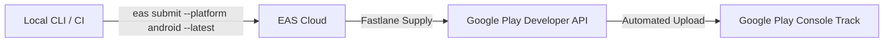

# Google Play Store CLI Automated Submission Guide 🚀

> Production-tested guide for automated Play Store app submissions using **EAS Submit**, **Fastlane Supply**, and **Google Play Developer Service Accounts**.

---

## Overview

This project is configured to support **one-command CLI submissions** directly to the Google Play Console using Expo Application Services (EAS).



---

## Verified Project Architecture & Configuration

| Parameter | Value |
| :--- | :--- |
| **App Identifier** | `com.dheeraj.chorpolice` |
| **EAS Owner** | `@dheeraj_kumar_yadav` |
| **Google Cloud Org** | `rahulkumar9508820247-org` |
| **Google Cloud Project** | `expo submit bot` (`expo-submit-bot`) |
| **Service Account Email** | `eas-auto-submission@chor-police-playstore.iam.gserviceaccount.com` |
| **API Name** | `Google Play Android Developer API` (`androidpublisher.googleapis.com`) |
| **API Link** | [https://console.cloud.google.com/apis/library/androidpublisher.googleapis.com?project=expo-submit-bot](https://console.cloud.google.com/apis/library/androidpublisher.googleapis.com?project=expo-submit-bot) |

---

## Complete Setup & Verification Checklist

### Step 1: Google Cloud Service Account (`expo submit bot`)

1. Open [Google Cloud Service Accounts](https://console.cloud.google.com/iam-admin/serviceaccounts?project=expo-submit-bot).
2. Service Account created: `eas-auto-submission@chor-police-playstore.iam.gserviceaccount.com`.
3. Key source: Stored securely on EAS Cloud servers.

---

### Step 2: Google Play Console Permissions

1. Open [Google Play Console Users & Permissions](https://play.google.com/console/developers/users).
2. Active user: `eas-auto-submission@chor-police-playstore.iam.gserviceaccount.com`.
3. **App Permissions**:
   - App: `Raja Mantri chor sipahi` (`com.dheeraj.chorpolice`).
   - Granted permissions: **13 permissions** (Release to main track, testing tracks, view app info).
4. **Important**: Click the blue **Save changes** button at the bottom right corner of Google Play Console to commit permission updates.

---

### Step 3: Google Play Android Developer API Activation

1. Open [Google Play Android Developer API for `expo submit bot`](https://console.cloud.google.com/apis/library/androidpublisher.googleapis.com?project=expo-submit-bot).
2. Status: **`Enabled`**.

> **Note**: After enabling the API, Google Cloud auth servers require **3–5 minutes** to propagate changes globally.

---

## Submission Commands

### 1. Primary Automated CLI Submission (Latest EAS Build)

```bash
eas submit --platform android --latest
```

### 2. Non-Interactive Mode (For CI/CD Pipelines)

```bash
eas submit --platform android --latest --non-interactive
```

### 3. Submitting a Specific Local AAB File

```bash
eas submit --platform android --path ./build-output.aab
```

### 4. Overwriting Credentials with a Custom Key JSON File

```bash
eas submit --platform android --latest --service-account-key-path C:\path\to\service-account.json
```

---

## Troubleshooting & Verification Matrix

| Error Code / Message | Verified Root Cause | Exact Resolution |
| :--- | :--- | :--- |
| `PERMISSION_DENIED: Google Play Android Developer API has not been used in project...` | API is disabled on the GCP project or permission propagation delay | Open [GCP Console for `expo submit bot`](https://console.cloud.google.com/apis/library/androidpublisher.googleapis.com?project=expo-submit-bot), click **ENABLE**, and wait 3–5 minutes. |
| `Google Api Error: Invalid credentials` | Service Account email not invited to Play Console | Add `eas-auto-submission@...` under Play Console **Users & Permissions**. |
| `Unsaved changes on Google Play Console` | App permissions selected but **Save changes** was not clicked | Open Play Console → **Users & Permissions** → Select `eas-auto-submission` → Click blue **Save changes** at bottom right. |
| `User does not have access to this app` | Service Account lacks explicit app assignment | Add `com.dheeraj.chorpolice` to the Service Account's **App permissions** list. |

---

## Configuration Reference ([`eas.json`](file:///c:/Users/rahul/work/chorpolice-1/chorpolice/eas.json))

```json
{
  "submit": {
    "production": {
      "android": {
        "track": "internal",
        "releaseStatus": "completed"
      }
    }
  }
}
```

---
*Verified Production Pipeline Guide for Chor Police.*
