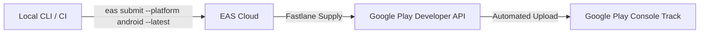

# Google Play Store CLI Automated Submission Guide 🚀

> Step-by-step guide for automated Play Store app submissions using **EAS Submit**, **Fastlane Supply**, and **Google Play Developer Service Accounts**.

---

## Overview

This project is configured to support **one-command CLI submissions** directly to the Google Play Console using Expo Application Services (EAS).



---

## Prerequisites

1. **EAS CLI**: Installed globally (`npm i -g eas-cli`) or via project (`npx eas-cli`).
2. **Google Play Developer Account**: Active owner/admin access to [play.google.com/console](https://play.google.com/console).
3. **EAS Account**: Logged in as `@dheeraj_kumar_yadav`.

---

## Complete Setup Architecture

### Step 1: Google Cloud Service Account Setup

1. Open [Google Cloud Console IAM Service Accounts](https://console.cloud.google.com/iam-admin/serviceaccounts).
2. Click **+ CREATE SERVICE ACCOUNT**.
   - **Name**: `eas-auto-submission`
   - **Service Account ID**: `eas-auto-submission@chor-police-playstore.iam.gserviceaccount.com`
3. Grant Role: **Service Account User** / **Editor**.
4. Create & download JSON key:
   - Go to **KEYS** tab → **ADD KEY** → **Create new key** → Select **JSON**.
   - Save key securely as `service-account.json`.

---

### Step 2: Google Play Console Permissions Assignment

1. Open [Google Play Console Users & Permissions](https://play.google.com/console/developers/users).
2. Click **Invite new users**.
3. Paste Service Account Email: `eas-auto-submission@chor-police-playstore.iam.gserviceaccount.com`.
4. **App Permissions**:
   - Add App: **Chor Police** (`com.dheeraj.chorpolice`).
   - Select permissions: **Release to main track**, **Release to testing tracks**, **View app information**.
5. **Account Permissions**:
   - Enable: **Admin (all permissions)** or **Manage production releases**.
6. Click **Invite user** → **Save changes** (Ensure changes are saved!).

---

### Step 3: Google Play Android Developer API Activation

Ensure the Google Play Developer API is enabled on your Google Cloud Project:

1. Open [Google Play Android Developer API Library](https://console.cloud.google.com/apis/library/androidpublisher.googleapis.com).
2. Select your project.
3. Click **ENABLE**.

> **Note**: Google Cloud permissions can take **3–5 minutes** to propagate across authentication servers after initial activation.

---

## Submission Commands

### Standard Automated Submission (Latest EAS Build)

```bash
# Submit latest production build from EAS Cloud
eas submit --platform android --latest
```

### Non-Interactive Mode (for CI/CD Pipelines)

```bash
eas submit --platform android --latest --non-interactive
```

### Submitting a Specific Local AAB File

```bash
eas submit --platform android --path ./build-output.aab
```

### Overwriting Stale Credentials with a New Key

```bash
eas submit --platform android --latest --service-account-key-path ./path-to-key.json
```

---

## Troubleshooting Guide

| Error Message | Cause | Resolution |
| :--- | :--- | :--- |
| `PERMISSION_DENIED: Google Play Android Developer API has not been used...` | API disabled or recently enabled and still propagating | Click **Enable** on [Google Cloud API Page](https://console.cloud.google.com/apis/library/androidpublisher.googleapis.com) and wait 3–5 minutes. |
| `Google Api Error: Invalid credentials` | Service Account email not invited to Play Console | Invite `eas-auto-submission@...` under Play Console **Users & Permissions**. |
| `Unsaved changes on Google Play Console` | Permissions added but **Save changes** button wasn't clicked | Go to Play Console → **Users & Permissions** → Select Service Account → Click **Save changes** at bottom right. |
| `User does not have access to this app` | Service Account user lacks App Permissions | Add `com.dheeraj.chorpolice` to the service account's App Permissions list. |

---

## Configuration Reference ([`eas.json`](file:///c:/Users/rahul/work/chorpolice-1/chorpolice/eas.json))

```json
{
  "submit": {
    "production": {
      "android": {
        "track": "internal",
        "releaseStatus": "completed"
      }
    }
  }
}
```

---
*Created for Chor Police Automated Production Pipeline.*
