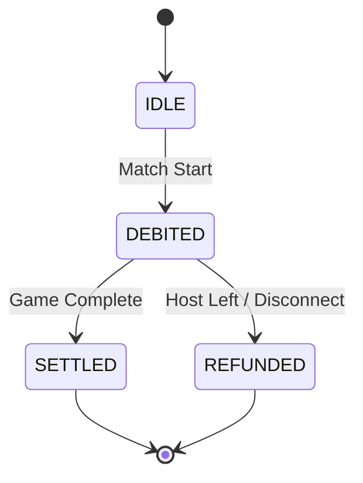

# Economy System & Coin Safety

## 💰 Core Transactions

### 1. Stake Debit
- **Trigger**: Match Start.
- **Guard**: `economy.stakeDebited` flag in Redux.
- **Logic**: Deducts `stakeAmount` from the player's wallet. If a player re-joins the same match, this flag prevents double-debiting.

### 2. Settlement
- **Trigger**: `GAME_END` (Reason: `completed`).
- **Logic**: 
  - Host calculates the `totalPot`.
  - Winnings are distributed based on the final leaderboard.
  - Guard: `settlementStatus === "PENDING"`. Once set to `SETTLED`, further packets are ignored.

### 3. Fairness Refunds
- **Trigger**: Host Disconnect or Player Leave.
- **Logic**: If the match ends prematurely and the player has already been debited, the `stakeAmount` is refunded to their wallet.
- **Status**: Mark as `REFUNDED`.

## 🛡️ Idempotency Protection

To ensure coin safety, the economy system uses a state-machine approach:

## 🚨 Edge Cases
- **Host Quit**: The Host broadcasts a `GAME_END` with `host_quit`. All clients process an immediate refund.
- **Client Forfeit**: If a client manually exits, they forfeit their stake. Other players remain in the game (unless it's the Host).
- **Reconnect**: If a player re-enters a match they already paid for, `handleStakeDebit` checks the Redux flag and skips the transaction.

---
[Packet System](./packet-system.md) | [Reconnect System](./reconnect-system.md)
