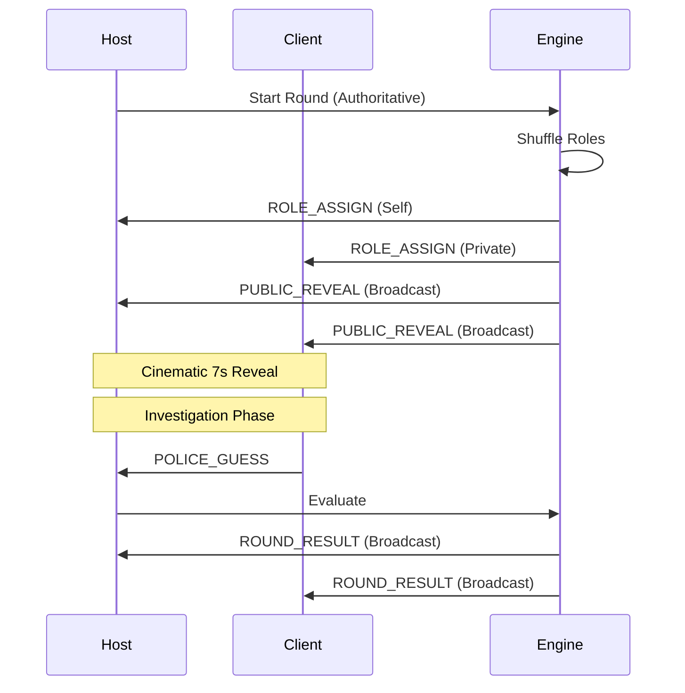

# Multiplayer Architecture

## 📡 Networking Stack
The multiplayer system is built on top of a custom TCP transport layer designed for high reliability in offline (hotspot) environments.

### 1. LAN Discovery
- **Hotspot IP Detection**: Uses specific fallbacks for Android/iOS to identify the gateway (Host) IP.
- **Port Strategy**: Standardized port rotation to prevent "Address Already in Use" errors during rapid restarts.

### 2. TCP Transport (`GameSessionTransport`)
- **Packet Framing**: Each message is prefixed with a length header to prevent "Partial Packet" corruption.
- **Bi-Directional**: Host maintains a map of Client sockets; Clients maintain a persistent connection to the Host.

## 🧱 Logic Components

### Packet Router (`PacketRouter.ts`)
The central dispatcher. It receives raw JSON packets and routes them based on their `type` string.
- **Host Route**: Logic that modifies game state (Host only).
- **Public Route**: Logic that updates UI/Redux (All players).

### Handlers (`hooks/chorPoliceMultiplayer/handlers/`)
Specialized modules that handle specific groups of packets:
- **RevealHandlers**: Cinematic animation triggers.
- **PoliceHandlers**: Investigation and guess processing.
- **QuizHandlers**: End-game educational trivia.
- **SessionHandlers**: Reconnects and departures.

## 🔄 Reconnect System
Designed for "Production Grade" reliability:
1. **Heartbeat Monitoring**: Pings every 2s; if missed for 5s, the player is marked `RECONNECTING`.
2. **Recovery Window**: 20s grace period for the player to rejoin.
3. **SYNC_STATE**: Upon rejoining, the Host sends a binary-equivalent snapshot of the game state to the reconnected client.
4. **Bot Replacement**: If the window expires, the engine replaces the human with a bot to prevent game stalling.

## 📊 Sequence Diagram (Typical Round)

---
[Overview](./OVERVIEW.md) | [Packet System](./packet-system.md) | [Reconnect System](./reconnect-system.md)
